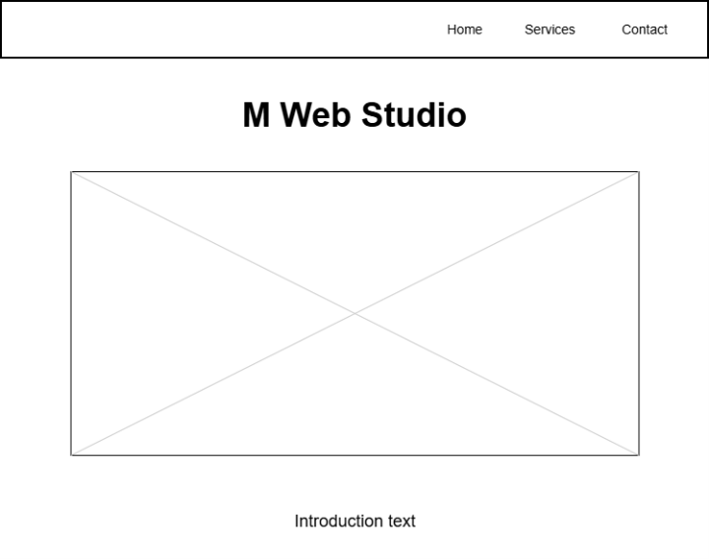
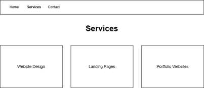
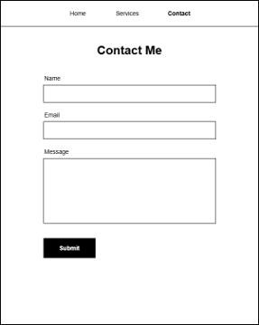

# M-Web-Studio

## Author
Manuela Escobar

## How to Use
Users can navigate through the site using the navigation bar to view services and contact the business through the form.

## Description
This is a freelance web design website for M Web Studio. It includes a homepage, services page, and contact page.

## Features
- Navigation bar
- Multi-page layout
- Homepage image
- Services section with cards
- Contact form
- CSS styling

## Technologies Used
- HTML
- CSS

## Future Improvements
- Add animations
- Improve mobile responsiveness
- Add more project examples

## User Stories
- As a potential client, I want to view the homepage so I can understand what M Web Studio offers.
- As a user, I want to see the services page so I can learn about the available web design services.
- As a visitor, I want to use the contact form so I can reach out for a project.

## Wireframes

### Homepage

### Services Page

### Contact Page
